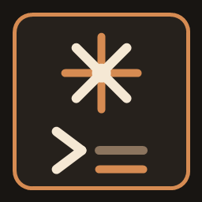
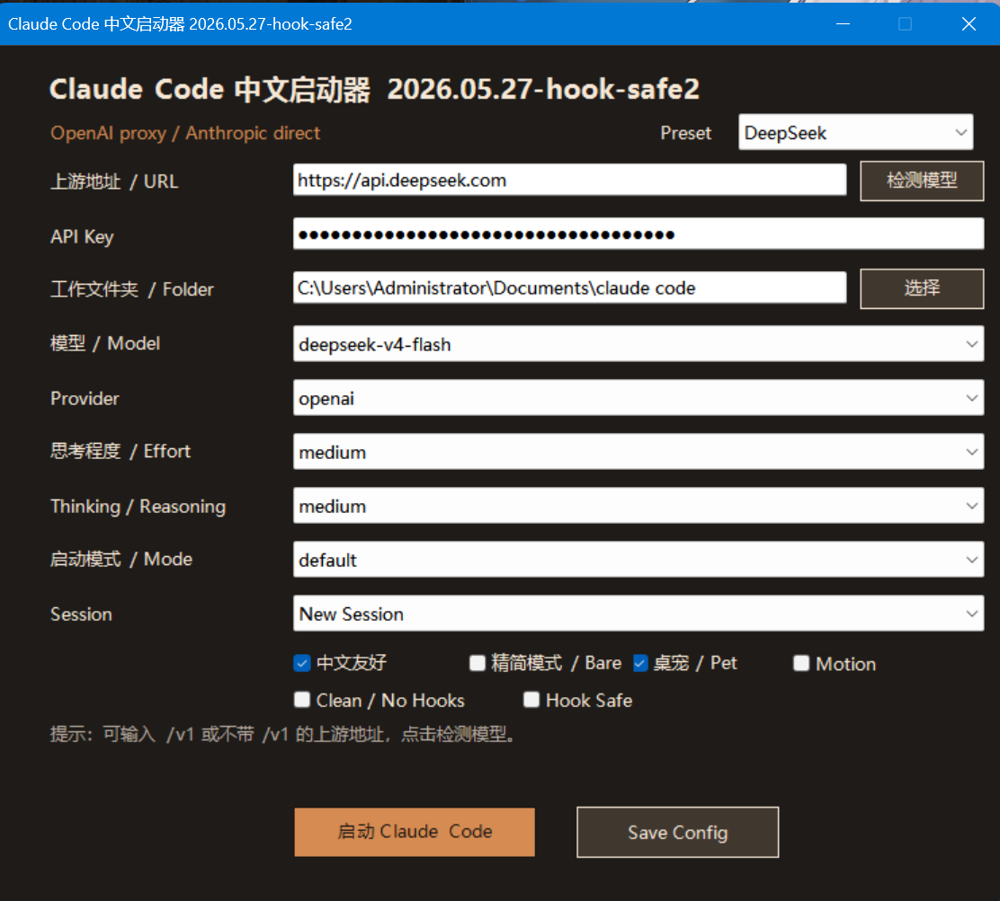

# Claude Code 中文启动器

一个给 Windows 用户准备的 Claude Code 一键安装与中文启动器。下载 Release、解压、双击启动脚本，填入你自己的 API Key，就可以用 DeepSeek、OpenRouter、硅基流动或其他 OpenAI-compatible 中转开始编程。

<p align="center">
  
</p>



## 适合谁

- 想在 Windows 上快速跑起 Claude Code，但不想手动折腾环境变量和启动参数。
- 想用 DeepSeek V4、OpenRouter、硅基流动、智谱、DashScope、Moonshot/Kimi、OpenAI-compatible 中转等模型接入 Claude Code。
- 希望启动界面是中文说明，常见英文状态和错误也有中文辅助解释。
- 希望默认保留模型的 thinking/reasoning 能力，不被启动器静默关闭。

## 快速开始

1. 打开右侧或下方的 GitHub Releases，下载 `ClaudeCode-ZH-Launcher-v1.0.2.zip`。
2. 解压到任意目录。
3. 双击 `一键启动.cmd`。
4. 在启动器里选择服务商预设，填入 URL、模型和你自己的 API Key。
5. 点击启动，开始使用 Claude Code 编程。

第一次运行时，脚本会自动复制安装目录到 `文档\claude code`，检查 Node.js/npm，安装 Claude Code 依赖，并创建桌面快捷方式。后续直接从快捷方式或启动器进入即可。

## 常用配置

DeepSeek 官方：

```text
URL: https://api.deepseek.com
Model: deepseek-v4-flash
Provider: auto 或 openai
Reasoning: auto
```

OpenRouter 推荐直连 Anthropic-compatible：

```text
URL: https://openrouter.ai/api
Model: deepseek/deepseek-v4-flash
Provider: anthropic
API Key: 你的 sk-or-... OpenRouter key
Reasoning: auto
```

硅基流动：

```text
URL: https://api.siliconflow.cn/v1
Model: deepseek-ai/DeepSeek-V4-Flash
Provider: auto 或 openai
Reasoning: auto
```

任意 OpenAI-compatible 中转：

```text
URL: 你的 /v1 或服务根地址
Model: 中转支持的模型名
Provider: openai
Reasoning: auto/off/low/medium/high/xhigh/max
```

## Thinking / Reasoning

启动器默认使用 `auto`，能力优先：不会主动把 DeepSeek、硅基流动或 OpenRouter 的思考/推理能力关掉。

只有你显式选择 `off` 时，脚本才会向支持的上游发送关闭 thinking/reasoning 的参数。`low`、`medium`、`high`、`xhigh`、`max` 会尽量映射到对应服务商支持的推理强度。

本地代理也会在 tool call 多轮对话中回放 `reasoning_content`/`reasoning`，减少 thinking 模型因为缺少推理历史而出现的兼容错误。

## 里面有什么

- `一键启动.cmd`：给普通用户双击的入口，适合 DeepSeek、OpenRouter、硅基流动和各类中转。
- `OneClick-Launcher.ps1`：一键安装、复制、依赖安装、快捷方式创建和首次配置。
- `scripts/claude-launcher.ps1`：中文图形启动器。
- `scripts/start-claude.ps1`：实际启动 Claude Code 的脚本。
- `scripts/deepseek-claude-proxy.cjs`：把 Anthropic `/v1/messages` 转成 OpenAI-compatible `/v1/chat/completions` 的本地代理。
- `docs/claude-code-ui-zh.md`：Claude Code 常见英文界面提示中文对照。
- `prompts/chinese-friendly.md`：中文友好的 Claude Code 提示词。

## 安全说明

本仓库和 Release 包不会包含作者本机的 `.env.local`、API Key、日志、旧压缩包、`node_modules` 或本地运行目录。

你的 API Key 只会写入本机安装目录里的 `.env.local` 和启动器本地配置。提交 issue 或截图时，请遮住 key、token、余额、账号邮箱等敏感信息。

## 常见问题

如果提示 Node.js/npm 不存在，脚本会优先尝试使用 `winget` 安装 Node.js LTS。没有 `winget` 的机器可以先手动安装 Node.js LTS，再重新运行。

如果提示 `402 Insufficient Balance`，说明上游 API Key 余额不足，需要充值或换 key。

如果 Claude Code 一直进入 `/login` 或报认证冲突，建议重新打开启动器保存一次配置；脚本会为 OpenAI-compatible 模式使用本地代理 token，避免和 Claude 官方认证方式冲突。

更完整的说明见 [一键部署说明.md](一键部署说明.md)。
